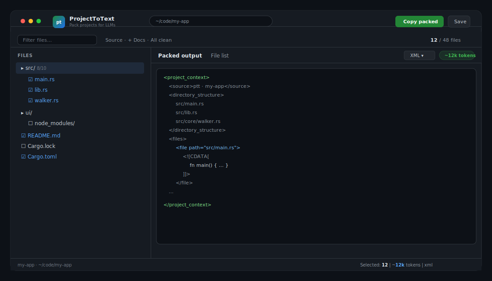

# ptt — ProjectToText

**Pack any project into high-quality, LLM-ready text — with Git-accurate ignore rules.**

[](https://github.com/krzysztofautomatyk/ProjectToText/actions/workflows/ci.yml)
[](LICENSE)
[](https://www.rust-lang.org/)
[](https://tauri.app/)

`ptt` is a native desktop app (Tauri v2 + React) that turns a folder into curated context for ChatGPT, Claude, Gemini, Cursor, and other LLMs. It respects `.gitignore` the way Git does, supports an extra `.pttignore`, and exports XML / Markdown / JSON / plain text.

---

## Why ptt?

| Problem | How ptt helps |
|--------|----------------|
| Dragging a whole monorepo into a chat wastes tokens | Smart **Source / Docs / All clean** presets |
| `node_modules`, `target`, secrets leak into prompts | **Git-native** ignore (`.gitignore` + optional `.pttignore`) |
| Ad-hoc scripts produce brittle JSON/XML | Production formats with **safe escaping**, size limits, binary detection |
| CLI-only tools are awkward for selection | **Visual tree**, filter, expand/collapse, keyboard shortcuts |

Inspired by tools like [Repomix](https://github.com/yamadashy/repomix), focused on a **desktop-first, selection-first** workflow.

---

## Features

- **Git-accurate scanning** — prefers `git ls-files --exclude-standard`; falls back to the Rust `ignore` crate
- **`.pttignore`** — extra exclusions for LLM packing without changing your real ignore rules
- **Formats**: XML (recommended for LLMs), Markdown, JSON, Plain
- **Safety**: per-file size limit (default 2 MiB), binary detection, UTF-8 decoding with notes
- **UI**: file tree with partial selection, filter, presets, token estimate, light/dark/system theme
- **Workflow**: copy packed output, copy file list (tree or paths), save to disk, drag-and-drop folder
- **Keyboard shortcuts**: open, refresh, filter, copy, save, help (`?`)

---

## Screenshots

> Open a project → curate selection → **Copy packed** into your LLM.



---

## Install / run from source

### Prerequisites

| Tool | Why | Install |
|------|-----|---------|
| **Rust + Cargo** (1.77+) | Builds the desktop app (`cargo` is **not** preinstalled on Windows) | https://rustup.rs/ — then **restart the terminal** |
| **Node.js** 20+ | Frontend (`npm`) | https://nodejs.org/ (LTS) |
| **Git** | Clone + best ignore fidelity | https://git-scm.com/ |
| **Tauri OS deps** | WebView + linker | https://v2.tauri.app/start/prerequisites/ |

**Windows note:** if `cargo` is “not recognized”, install Rust via rustup, ensure `%USERPROFILE%\.cargo\bin` is on PATH, and open a **new** PowerShell/CMD. You also need Visual Studio Build Tools (“Desktop development with C++”) and WebView2. Full walkthrough: [CONTRIBUTING.md](CONTRIBUTING.md).

Verify before building:

```bash
rustc -V
cargo -V
node -v
npm -v
```

### Develop

```bash
# 1) Frontend deps
npm --prefix ui install

# 2) Tauri CLI (once per machine)
cargo install tauri-cli --version "^2"

# 3) Run the desktop app (from repo root)
cargo tauri dev
```

### Build release

```bash
npm --prefix ui install
cargo tauri build
```

Artifacts land under `target/release/bundle/` (`.msi` / `.exe` on Windows, `.dmg` / `.app` on macOS, etc.).

### Tests

```bash
cargo test
npm --prefix ui run build   # typecheck + Vite production build
```

---

## Usage

1. **Open** a folder (button, `⌘/Ctrl+O`, or drag-and-drop).
2. Review the tree — defaults favor **source** files and skip common junk.
3. Adjust selection (folder checkboxes support partial state).
4. Pick format (**XML** recommended for most models).
5. **Copy packed** into your chat / agent, or **Save** to a file.

### `.pttignore`

Same syntax as `.gitignore`. Example:

```gitignore
# Extra files you never want in LLM context
*.log
fixtures/large/**
**/generated/**
.env*
```

### Output formats

| Format | Best for |
|--------|----------|
| **XML** | Claude / structured prompts (default) |
| **Markdown** | Readable chat paste |
| **JSON** | Tooling / pipelines |
| **Plain** | Simple separators |

---

## Architecture

```
ProjectToText/
├── src/
│   ├── lib.rs           # Pure core library crate (`ptt`)
│   ├── main.rs          # Tauri binary: scan, generate, save, clipboard
│   └── core/
│       ├── walker.rs    # git ls-files / ignore + .pttignore
│       └── output.rs    # XML / MD / JSON / plain writers
├── ui/                  # React + Vite + TypeScript frontend
├── docs/                # Architecture notes + assets
├── capabilities/        # Tauri v2 ACL
├── icons/               # App icons
└── tauri.conf.json
```

Core modules (`walker`, `output`) live in the **library crate** and stay unit-testable without the GUI.  
See [docs/ARCHITECTURE.md](docs/ARCHITECTURE.md) for the full diagram.

---

## Security notes

- Scanning is **local only** — no network calls for packing.
- Symlinks that escape the project root are skipped.
- Binary files and oversized files are replaced with short notes, not dumped into context.
- Clipboard / save require explicit user action.

See [SECURITY.md](SECURITY.md) for reporting vulnerabilities.

---

## Contributing

Contributions are welcome. See [CONTRIBUTING.md](CONTRIBUTING.md).

---

## License

Licensed under either of:

- Apache License, Version 2.0 ([LICENSE-APACHE](LICENSE-APACHE))
- MIT license ([LICENSE-MIT](LICENSE-MIT))

at your option.

---

## Acknowledgements

- [Tauri](https://tauri.app/) — lightweight native shell
- [ignore](https://crates.io/crates/ignore) — gitignore-compatible walking
- Ideas from the broader “repo → LLM context” ecosystem (e.g. Repomix)

---

**Author:** [krzysztofautomatyk](https://github.com/krzysztofautomatyk)
