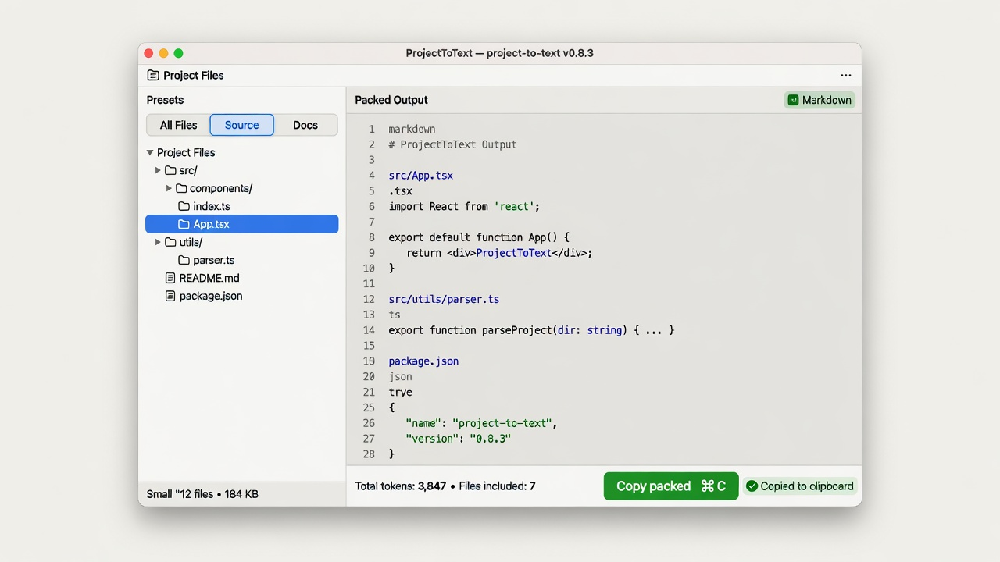
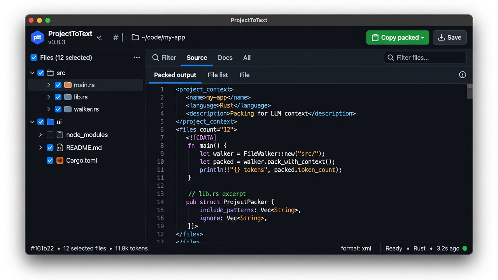
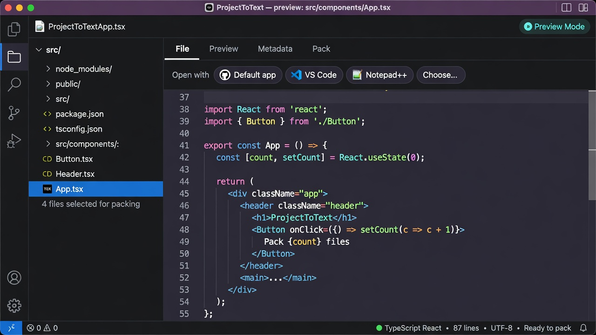

# ProjectToText (`ptt`)

### Pack any project into high-quality, LLM-ready text — with Git-accurate ignore rules.

[](https://github.com/krzysztofautomatyk/ProjectToText/actions/workflows/ci.yml)
[](LICENSE)
[](https://www.rust-lang.org/)
[](https://tauri.app/)
[](https://github.com/krzysztofautomatyk/ProjectToText/releases)

**Native desktop app** (Tauri v2 + React) that turns a folder into curated context for ChatGPT, Claude, Gemini, Cursor, Copilot, and other LLMs.  
Respects `.gitignore` the way Git does, supports extra `.pttignore`, and exports **XML · Markdown · JSON · plain text**.

<p align="center">
  
</p>

<p align="center"><sub>Open a project → curate selection → <b>Copy packed</b> into your LLM.</sub></p>

---

## Why ptt?

| Pain | What ptt does |
|------|----------------|
| Dumping a monorepo into chat wastes tokens | Smart **Source / Docs / All clean** presets |
| `node_modules`, `target`, secrets leak into prompts | **Git-native** ignore (`.gitignore` + optional `.pttignore`) |
| Ad-hoc scripts produce brittle JSON/XML | Production formats with **safe escaping**, size limits, binary detection |
| CLI-only tools are awkward for selection | **Visual tree**, filter, partial folder selection, keyboard shortcuts |
| Need to inspect a file before packing | **Syntax-highlighted preview** + open with VS Code / default app |

Inspired by tools like [Repomix](https://github.com/yamadashy/repomix), optimized for a **desktop-first, selection-first** workflow.

---

## Screenshots

| Main workspace (dark) | File preview + open-with | Light theme + Markdown |
|:---:|:---:|:---:|
|  |  |  |
| Tree · presets · XML pack | Click file · syntax · VS Code | .NET / XAML Source · MD |

Vector mockups (crisp on HiDPI): [`01-main.svg`](docs/screenshots/01-main.svg) · [`02-preview.svg`](docs/screenshots/02-preview.svg) · [`03-light.svg`](docs/screenshots/03-light.svg)

---

## Features

- **Git-accurate scanning** — prefers `git ls-files --exclude-standard`; falls back to the Rust `ignore` crate
- **`.pttignore`** — extra LLM exclusions without touching real ignore rules
- **Formats**: XML (recommended for LLMs), Markdown, JSON, Plain
- **Safety**: per-file size limit (default 2 MiB), binary detection, UTF-8 notes, symlink escape guard
- **UI**: partial folder selection, filter, token estimate, light / dark / system theme
- **.NET-aware Source preset**: `.xaml`, `.cs`, `.csproj`, `.razor`, `.sln`, and related files
- **File preview**: click a file for syntax highlighting; open with system default, VS Code, Notepad++, or pick an app
- **Desktop + browser**: full power in Tauri; pack/preview also works in Vite browser via folder picker
- **Headless CLI**: `ptt pack [DIR]` — same git-native engine, CI-friendly
- **Workflow**: copy packed output, copy file list, save to disk, drag-and-drop folder
- **Shortcuts**: open, refresh, filter, copy, save, help (`?`)
- **Honest token estimate**: UI shows **approx** tokens (`chars ÷ 3.8`), not a model tokenizer

---

## Install

### Prebuilt desktop apps (recommended)

Download the installer for your OS from the latest GitHub Release:

**→ [Releases](https://github.com/krzysztofautomatyk/ProjectToText/releases/latest)**

| Platform | Typical assets |
|----------|----------------|
| **macOS** | `.dmg` / `.app` (Apple Silicon + Intel builds) |
| **Windows** | `.msi` / `.exe` |
| **Linux** | `.AppImage` / `.deb` (when produced by the release pipeline) |

After install, launch **ptt** from Applications / Start Menu, or run the binary from a terminal.

### Headless pack (CLI)

Once the binary is on your `PATH` (or via `cargo build --release`):

```bash
ptt pack .                              # XML to stdout
ptt pack ./my-app -f markdown -o ctx.md
ptt pack . --format json --no-summary > pack.json
ptt pack --help
```

Same ignore rules and formats as the desktop UI.

### From source

#### Prerequisites

| Tool | Why | Install |
|------|-----|---------|
| **Rust + Cargo** (1.77+) | Desktop + CLI binary | https://rustup.rs/ — then **restart the terminal** |
| **Node.js** 20+ | Frontend | https://nodejs.org/ (LTS) |
| **Git** | Clone + best ignore fidelity | https://git-scm.com/ |
| **Tauri OS deps** | WebView + linker | https://v2.tauri.app/start/prerequisites/ |

**Windows:** if `cargo` is “not recognized”, install Rust via rustup, ensure `%USERPROFILE%\.cargo\bin` is on `PATH`, open a **new** terminal. You also need Visual Studio Build Tools (“Desktop development with C++”) and WebView2. Full walkthrough: [CONTRIBUTING.md](CONTRIBUTING.md).

```bash
rustc -V && cargo -V && node -v && npm -v
```

#### Develop (desktop — recommended)

```bash
git clone https://github.com/krzysztofautomatyk/ProjectToText.git
cd ProjectToText

npm --prefix ui install
cargo install tauri-cli --version "^2"   # once per machine
cargo tauri dev
```

> Use **`cargo tauri dev`** for the real desktop window.  
> Browser-only `npm --prefix ui run dev` works for pack/preview (folder picker), but native dialogs and “Open with VS Code” need Tauri.

#### Release build (local)

```bash
npm --prefix ui install
cargo tauri build
```

Artifacts: `target/release/bundle/` (`.dmg` / `.app` · `.msi` / `.exe` · Linux packages).

```bash
# CLI only (no bundle)
cargo build --release
./target/release/ptt pack . -o /tmp/context.xml
```

### Tests

```bash
cargo test
npm --prefix ui run build
npm --prefix ui run test:e2e   # Playwright browser smoke (needs build + Chromium)
# or: make check
```

CI runs Rust tests + clippy + frontend build on **macOS, Linux, and Windows**, plus browser E2E smoke on Linux.  
Tag `v*.*.*` runs multi-OS Tauri builds and attaches installers to the GitHub Release.
---

## Usage

1. **Open** a folder (button, `⌘/Ctrl+O`, or drag-and-drop).
2. Review the tree — defaults favor **source** files and skip common junk.
3. Adjust selection (folder checkboxes support partial state).
4. Pick format (**XML** recommended for most models).
5. **Copy packed** into your chat / agent, or **Save** to a file.
6. Optional: click a file for **preview**, or open it in your editor.

### `.pttignore`

Same syntax as `.gitignore`:

```gitignore
# Extra files you never want in LLM context
*.log
fixtures/large/**
**/generated/**
.env*
secrets/**
```

### Output formats

| Format | Best for |
|--------|----------|
| **XML** | Claude / structured prompts (default) |
| **Markdown** | Readable chat paste |
| **JSON** | Tooling / pipelines |
| **Plain** | Simple separators |

---

## Architecture

```
ProjectToText/
├── src/
│   ├── lib.rs              # Pure core library crate (`ptt`)
│   ├── main.rs             # Tauri binary: scan, generate, save, clipboard
│   └── core/
│       ├── walker.rs       # git ls-files / ignore + .pttignore
│       ├── output.rs       # XML / MD / JSON / plain writers
│       └── preview.rs      # Safe file preview for the UI
├── ui/                     # React + Vite + TypeScript
│   └── src/
│       ├── App.tsx         # Tree, presets, packing UX
│       ├── FileViewer.tsx  # Syntax preview + open-with
│       └── browserFs.ts    # Browser folder picker fallback
├── docs/                   # Architecture + screenshots
├── capabilities/           # Tauri v2 ACL
├── icons/                  # App icons
└── tauri.conf.json
```

Core modules live in the **library crate** and are unit-tested without the GUI.  
Details: [docs/ARCHITECTURE.md](docs/ARCHITECTURE.md).

---

## Security

- Scanning is **local only** — no network calls for packing.
- Symlinks that escape the project root are skipped.
- Binary / oversized files become short notes, not raw dumps.
- Clipboard / save require explicit user action.
- Packed content can still include secrets if you select those files — use `.gitignore` / `.pttignore`.

See [SECURITY.md](SECURITY.md) for vulnerability reporting.

---

## Contributing

Contributions welcome. See [CONTRIBUTING.md](CONTRIBUTING.md) and [CODE_OF_CONDUCT.md](CODE_OF_CONDUCT.md).

```bash
cargo fmt --all
cargo clippy --all-targets -- -D warnings
cargo test
npm --prefix ui run lint && npm --prefix ui run build
```

---

## Changelog

See [CHANGELOG.md](CHANGELOG.md). Releases are cut from tags `v*.*.*` ([release workflow](.github/workflows/release.yml)).

---

## License

Licensed under either of:

- Apache License, Version 2.0 ([LICENSE-APACHE](LICENSE-APACHE))
- MIT license ([LICENSE-MIT](LICENSE-MIT))

at your option.

---

## Acknowledgements

- [Tauri](https://tauri.app/) — lightweight native shell  
- [ignore](https://crates.io/crates/ignore) — gitignore-compatible walking  
- [highlight.js](https://highlightjs.org/) — syntax highlighting in preview  
- Ideas from the broader “repo → LLM context” ecosystem (e.g. [Repomix](https://github.com/yamadashy/repomix))

---

**Author:** [krzysztofautomatyk](https://github.com/krzysztofautomatyk)  
**Repository:** [github.com/krzysztofautomatyk/ProjectToText](https://github.com/krzysztofautomatyk/ProjectToText)
